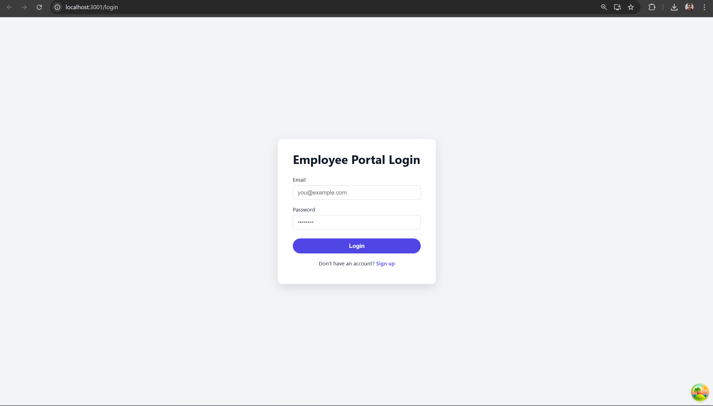
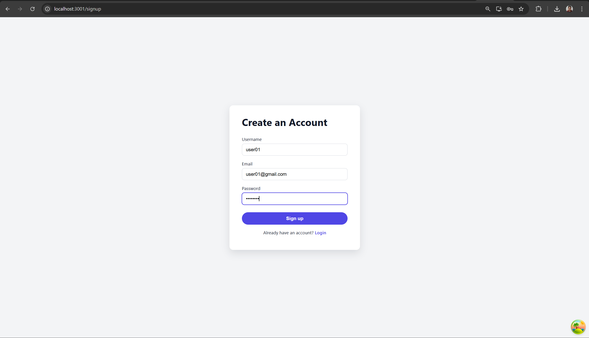
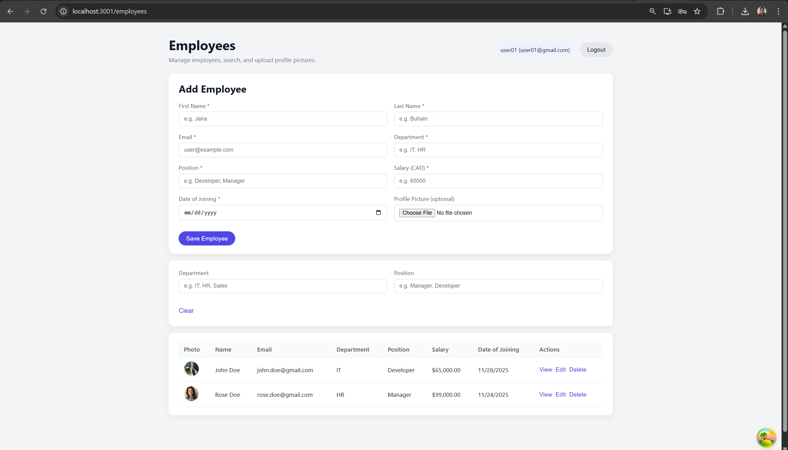
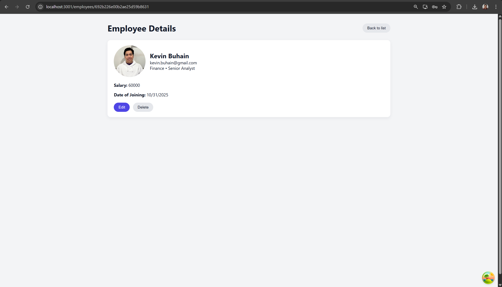
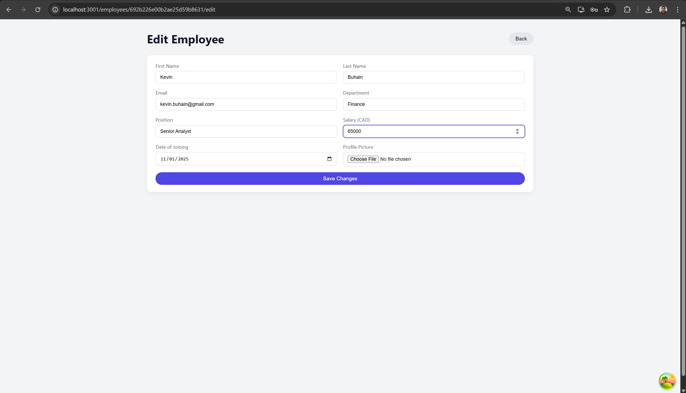
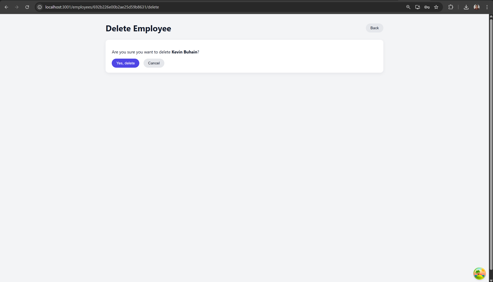
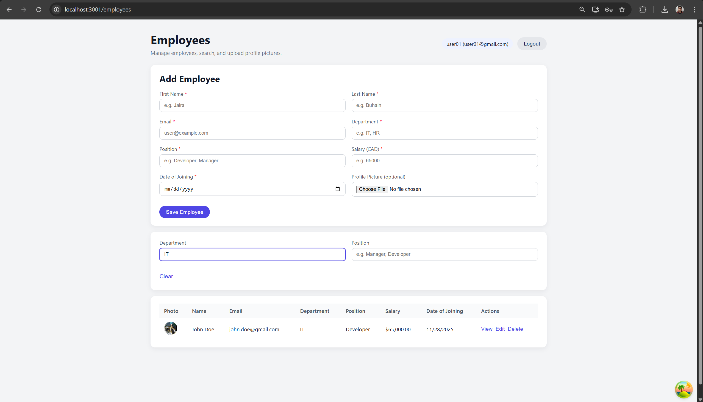
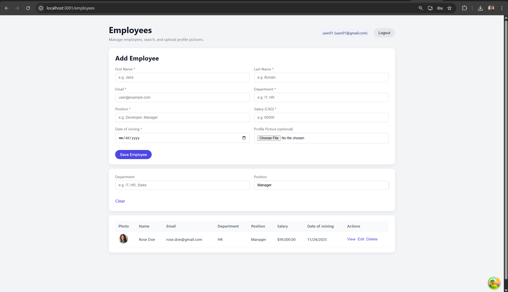

# COMP3123 – Assignment 2  
### **Full-Stack Employee Management System**  
**Student ID:** 101505276  
**Student Name:** Kevin George Buhain  

---

## 📌 Overview

This project is a **full-stack MERN employee management system** created for COMP3123 Assignment 2.

The application includes:

- **Backend** – Node.js, Express.js, MongoDB, JWT Authentication  
- **Frontend** – React.js, TanStack Query, React Router  
- **Database** – MongoDB (running as a container)  
- **File Uploads** – Employee profile pictures  
- **Search Filters** – Case-insensitive department/position search  
- **Deployment** – Fully containerized using Docker + Docker Compose  

This project demonstrates a complete real-world development workflow, including authentication, CRUD operations, image upload handling, and container orchestration.

---

## 🏗️ Tech Stack

### **Frontend**
- React.js  
- Axios  
- TanStack Query  
- React Router DOM  
- Custom CSS  

### **Backend**
- Node.js / Express.js  
- JWT Authentication  
- Multer for image upload  
- MongoDB via Mongoose  
- Express Validators  

### **DevOps**
- Docker  
- Docker Compose  

---

# 🐳 Running with Docker Compose (Deployment Method)

The entire application runs using **one command** thanks to Docker Compose.

### 1️⃣ Build and start all services

From the project root:

```bash
docker compose up --build

Docker will build:

| Service      | Port  | Description                         |
| ------------ | ----- | ----------------------------------- |
| **backend**  | 3000  | Node.js API with MongoDB connection |
| **frontend** | 3001  | React application                   |
| **mongo**    | 27017 | MongoDB database                    |

2️⃣ Access the application

React Frontend → http://localhost:3001

Backend API → http://localhost:3000/api/v1

MongoDB running in container → mongo:27017

3️⃣ Stop containers

docker compose down

✨ Features
🔐 Authentication

User Sign Up

Login

JWT-based Access

Protected Routes

👥 Employee Management

Add employees

Edit employees

Delete employees

View single employee (dedicated page)

Upload and store profile pictures

Display images in List / Edit / View pages

🔍 Search (Case-Insensitive)

Search by department

Search by position

Automatically updates UI

Partial matches allowed (dev → Developer)

🎨 UI/UX

Clean dashboard layout

Responsive employee table

Enlarged profile picture in View page

Clear error handling

📡 API Endpoints

Base URL (Docker local):

http://localhost:3000/api/v1

Auth Routes
Method	Endpoint	Description
POST	/auth/signup	Register user
POST	/auth/login	Authenticate user
Employee Routes
Method	Endpoint	Description
GET	/emp/employees	List all employees
GET	/emp/employees/search	Search by dept/position
GET	/emp/employees/:id	View one employee
POST	/emp/employees	Create employee with photo
PUT	/emp/employees/:id	Update employee
DELETE	/emp/employees?eid=ID	Delete employee

🧪 Testing the App
To test:

Create a user → login

Navigate to Employees page

Add employees with image upload

Search by department / position

Click View / Edit / Delete (each opens a dedicated page)

Logout

Everything runs entirely inside Docker, with no need for local Node or MongoDB installations.

📸 Screenshots 

Place your screenshots in a screenshots/ folder:
















